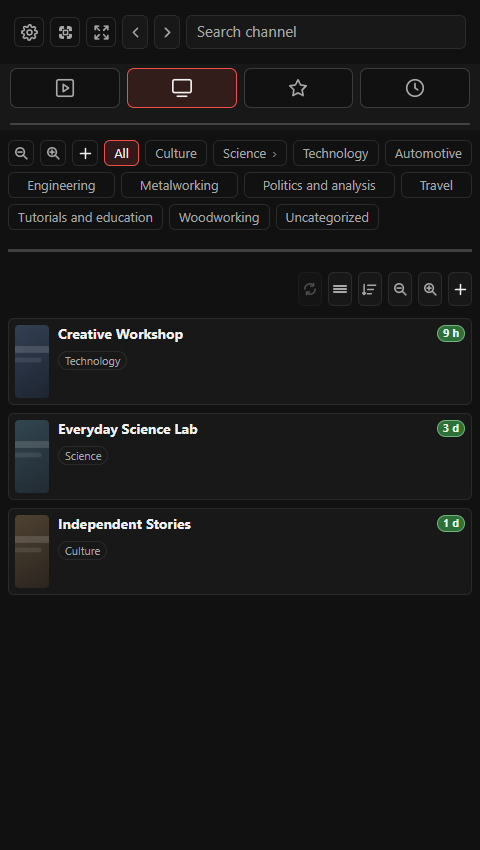

# YouTube Shelf

<p align="center">
  
</p>

<p align="center">
  A private, local-first YouTube organizer for Chromium side panels.
</p>

<p align="center">
  <strong>Version 3.3.19</strong> · English and French · GPL-3.0-or-later
</p>

YouTube Shelf keeps channels, recent uploads, favorite videos, and a personal watch-later list within reach while you browse YouTube. It runs as a narrow side panel or as a full-page workspace and does not require an account or a build step.

## What's included

- Four icon tabs: YouTube, Channels, Favorites and Watch later; adaptive layouts and compact channel cards.
- Weekly uploads, global YouTube search, categories, notes and drag-to-group favorites.
- Series/playlist badges beside titles; right-click discovery and numbered episode cards, refreshable as new parts appear.
- YouTube/Shelf subscription comparison: progressive loading, copy arrows and right-click removal/category assignment.
- Animated refresh controls. Click the dimmed weekly label to clear a search and return to weekly uploads.
- Fullscreen hides Shelf and restores it on exit; if the browser requires a gesture, the next page click restores it.
- Local backups, FreeTube import, NewPipe export and optional WebDAV/Nextcloud synchronization.

## Current interface

Real interface rendered with fictional channels, videos and placeholder thumbnails; no personal account data.

| Weekly videos | Channels |
| --- | --- |
|  |  |

### Series and playlists


### YouTube subscriptions


## Installation

YouTube Shelf currently supports Chromium-based browsers. Firefox compatibility is planned.

1. Download or clone this repository.
2. Open the extension management page for your browser:
   - Brave: `brave://extensions`
   - Chrome: `chrome://extensions`
   - Edge: `edge://extensions`
3. Enable **Developer mode**.
4. Select **Load unpacked**.
5. Choose the repository folder containing `manifest.json`.
6. Pin YouTube Shelf if you want quick access, then click its toolbar icon to open the side panel.

Updates installed from this repository are manual: replace the files, then use **Reload** on the browser's extension management page.

## Quick start

1. Open YouTube Shelf from the browser toolbar.
2. Search for a channel or paste a supported YouTube channel URL.
3. Add the channel and optionally assign one or more categories.
4. Open **YouTube** to browse recent videos.
5. Use the star action to save a video under **Favorites**, or add it to **Watch later**.
6. Use the display and sorting controls above each list to tailor the view.

The back and forward buttons navigate within the extension. The expand button opens full-page mode; the adjacent focus control changes how much of the surrounding YouTube page remains visible.

## Data and interoperability

### Local storage

Channels, categories, favorites, watched state, `Watch later`, preferences, and recent playback positions are stored in the browser's local extension storage.

The import/export dialog can:

- create a complete YouTube Shelf JSON backup;
- restore or merge a YouTube Shelf backup;
- import subscriptions from FreeTube;
- export subscriptions in NewPipe-compatible JSON.

Keep exported backups private if they contain personal notes or viewing organization.

### YouTube account (optional)

The **YouTube account** dialog compares **YouTube ← → Shelf** in compact rows. Shelf appears immediately; **Check subscriptions** fills YouTube progressively. Arrows copy one or all missing channels without removing the source. Right-click to unsubscribe on YouTube, or remove/classify a Shelf channel. Checks use your existing YouTube session without accessing your password; optional history stays local.

Compact channel cards, responsive icon tabs, and animated refresh controls keep navigation clear. Repeated channel additions are deduplicated, and weekly reset preserves the current view.

### WebDAV synchronization

Open **Settings → WebDAV synchronization**, then enter the full URL of the synchronization file, your Nextcloud username, and a dedicated application password. The default filename is:

```text
youtube-shelf-synchronized-data.json
```

Use **Test connection** before enabling synchronization. Credentials remain in the extension's local browser storage and are never included in synchronized data or exports. **Disconnect** removes the stored application password.

Synchronization includes content data—categories, channels, favorites, seen videos, and `Watch later`. Appearance, zoom, layout preferences, and regenerable YouTube feed caches remain local to each browser.

The newest configuration wins using its update timestamp, revision, and device identifier. Local changes are grouped for 10 seconds, remote changes are checked every 60 seconds while the panel is open, and conditional WebDAV writes use ETags to reduce overwrite conflicts.

## Privacy and permissions

YouTube Shelf has no analytics and no mandatory remote account. Its regular network access is limited to the resources needed to read YouTube pages, channel feeds, thumbnails, and release information. Reading account subscriptions uses the existing `youtube.com` website session only after an explicit action, and optional WebDAV access is requested only for the server origin chosen by the user.

The extension permissions are used to:

- store configuration and playback state locally;
- open and coordinate the side panel, full-page view, and YouTube tabs;
- adjust the YouTube page for focus and playback integration;
- add toolbar context-menu actions;
- access YouTube content and thumbnails;
- read account subscriptions from an explicitly opened, signed-in YouTube tab;
- check GitHub release metadata;
- connect to an explicitly configured HTTPS WebDAV server.

## Development

No compilation or bundling is required. Edit the source files, then reload the unpacked extension from the browser's extension management page.

Documentation captures use `tools/snapshot-server.mjs` and `tools/capture-readme.cjs` (Playwright). They render the real interface with fictional local fixtures and are not part of the extension runtime.

See [CHANGELOG.md](CHANGELOG.md) for release history.

## License

Copyright © 2026 nicklausFR

Licensed under [GPL-3.0-or-later](LICENSE).
