# YouTube Shelf

<p align="center">
  
</p>

<p align="center">
  A private, local-first YouTube organizer for Chromium side panels.
</p>

<p align="center">
  <strong>Version 3.3.19</strong> · English and French · GPL-3.0-or-later
</p>

YouTube Shelf keeps channels, recent uploads, favorite videos, and a personal watch-later list within reach while you browse YouTube. It runs as a narrow side panel or as a full-page workspace and does not require an account or a build step.

> All screenshots below show the current interface, using fictional channels, videos and placeholder thumbnails. The YouTube page in contextual captures is deliberately blurred.

## Preview

The extension remains a compact **420 px side panel** beside the current YouTube video.

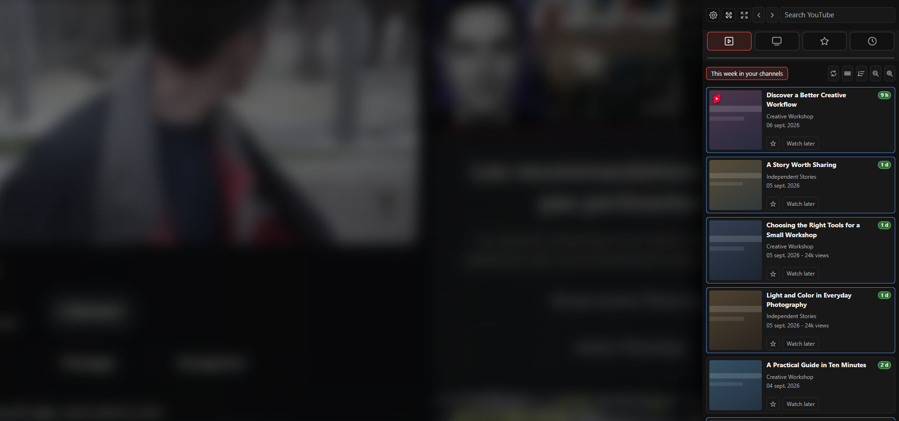

## Highlights

- Browse recent uploads by week, channel, or category.
- Search YouTube without leaving the extension and add channels from the results.
- Organize channels and favorites with ordered categories and subcategories.
- Save favorites, add notes, and merge videos by dropping one onto another favorite.
- Find series/playlists by right-clicking a video; open the title badge for numbered episode cards and refresh for new parts.
- Maintain a separate `Watch later` list.
- Switch between thumbnails, columns, cards, titles, and compact-title layouts.
- Sort channels and videos by name, date, subscribers, views, or date added.
- Select multiple favorites for bulk category assignment or deletion.
- Resume YouTube playback from locally saved positions for up to seven days.
- Focus the YouTube player by hiding comments or suggestions.
- Use the interface in English or French.
- Export backups, import YouTube Shelf or FreeTube data, and export subscriptions for NewPipe.
- Optionally synchronize content between browsers through WebDAV or Nextcloud.

## Interface

### Full-page workspace

The toolbar button switches between the browser side panel and a larger workspace. Video playback remains available inside full-page mode.

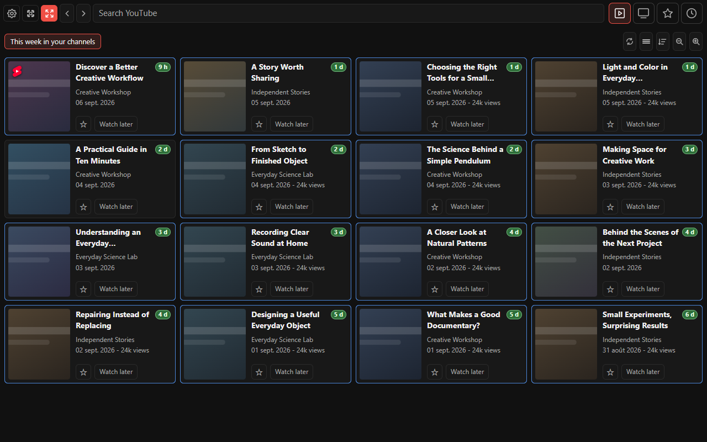

### Video display modes

Each list can use thumbnails only, adaptive columns, a single column, titles only, or compact titles with small thumbnails. Layout and zoom can be adjusted independently for each section.

| Thumbnails | Adaptive columns |
| --- | --- |
| 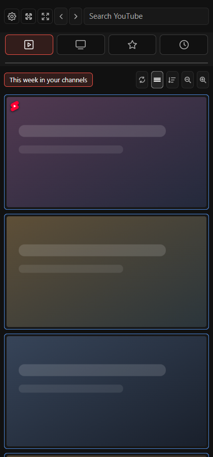 | 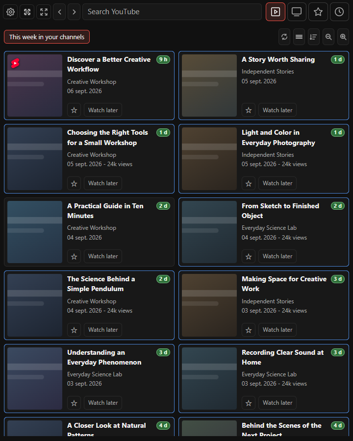 |

| Single column | Titles only |
| --- | --- |
|  | 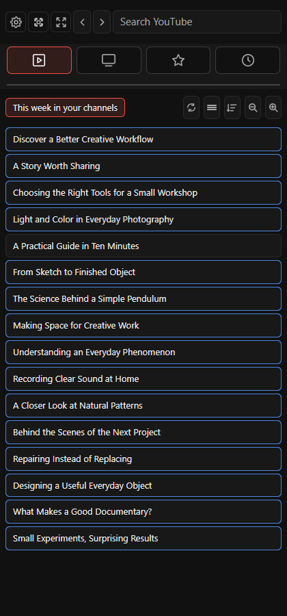 |

#### Compact titles with small thumbnails

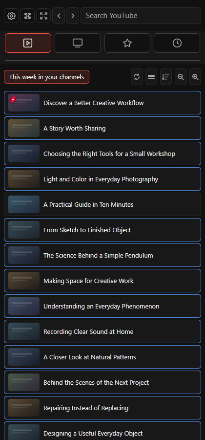

### Main sections

| YouTube / weekly uploads | Channels |
| --- | --- |
| 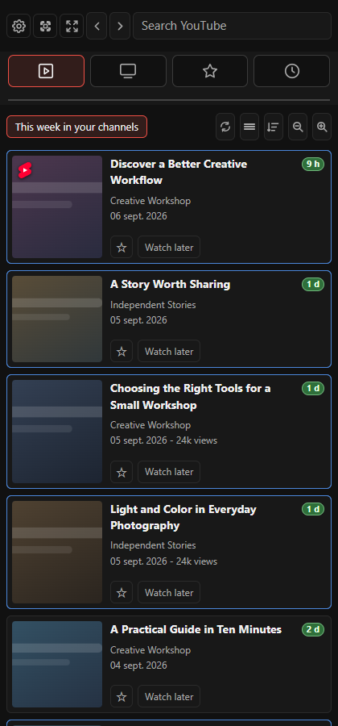 | 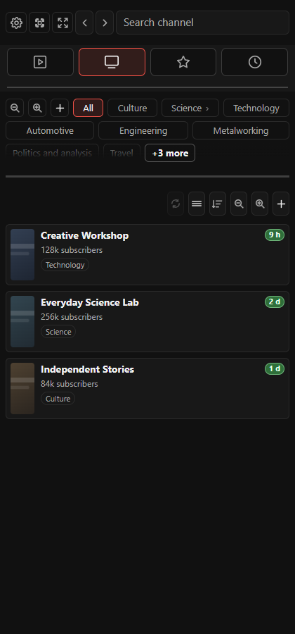 |

| Favorites | Watch later |
| --- | --- |
| 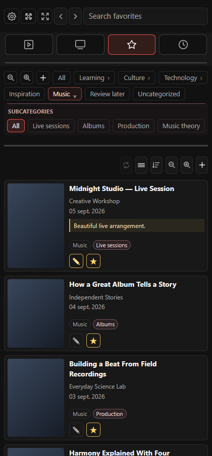 | 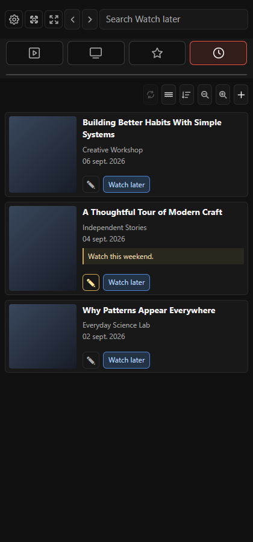 |

Favorites support large, ordered category trees. In this example, **Music** contains **Live sessions**, **Albums**, **Production**, and **Music theory**.

Search, sorting, notes, bulk selection and drag-and-drop grouping complement these views. On YouTube, clicking the dimmed weekly label clears the search and returns to weekly uploads.

<details>
<summary>Series and playlist discovery</summary>

Right-click a video to discover related parts, then open its title badge to view numbered episodes. Refresh the list as new parts appear.

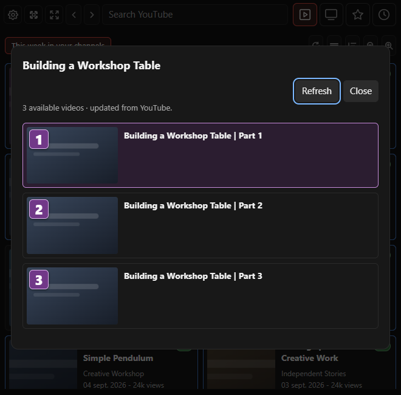

</details>

### Responsive layouts

YouTube Shelf adapts from a narrow browser panel to a wide layout. The four icon tabs share a single toolbar row when space allows.

<p align="center">
  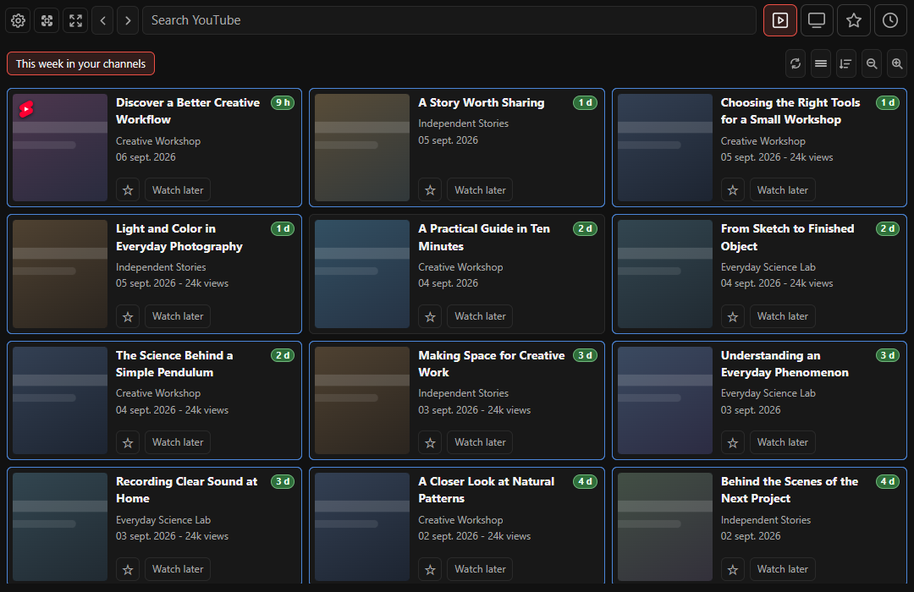
  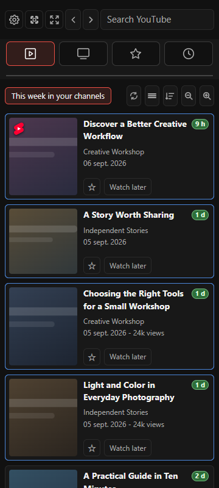
</p>

## Installation

YouTube Shelf currently supports Chromium-based browsers. Firefox compatibility is planned.

1. Download or clone this repository.
2. Open the extension management page for your browser:
   - Brave: `brave://extensions`
   - Chrome: `chrome://extensions`
   - Edge: `edge://extensions`
3. Enable **Developer mode**.
4. Select **Load unpacked**.
5. Choose the repository folder containing `manifest.json`.
6. Pin YouTube Shelf if you want quick access, then click its toolbar icon to open the side panel.

Updates installed from this repository are manual: replace the files, then use **Reload** on the browser's extension management page.

## Quick start

1. Open YouTube Shelf from the browser toolbar.
2. Search for a channel or paste a supported YouTube channel URL.
3. Add the channel and optionally assign one or more categories.
4. Open **YouTube** to browse recent videos.
5. Use the star action to save a video under **Favorites**, or add it to **Watch later**.
6. Use the display and sorting controls above each list to tailor the view.

YouTube fullscreen hides Shelf and restores it on exit; if the browser requires a gesture, the next page click restores it.

The back and forward buttons navigate within the extension. The expand button opens full-page mode; the adjacent focus control changes how much of the surrounding YouTube page remains visible.

## Data and interoperability

### Local storage

Channels, categories, favorites, watched state, `Watch later`, preferences, and recent playback positions are stored in the browser's local extension storage.

The import/export dialog can:

- create a complete YouTube Shelf JSON backup;
- restore or merge a YouTube Shelf backup;
- import subscriptions from FreeTube;
- export subscriptions in NewPipe-compatible JSON.

Keep exported backups private if they contain personal notes or viewing organization.

### YouTube account (optional)

The **YouTube account** dialog compares **YouTube ← → Shelf** in compact rows. Shelf appears immediately; **Check subscriptions** fills YouTube progressively. Arrows copy one or all missing channels without removing the source. Right-click to unsubscribe on YouTube, or remove/classify a Shelf channel. Checks use your existing YouTube session without accessing your password; optional history stays local.

Shelf channels appear immediately; YouTube channels arrive as the check progresses. Hover a channel for the right-click hint. Repeated additions are deduplicated.

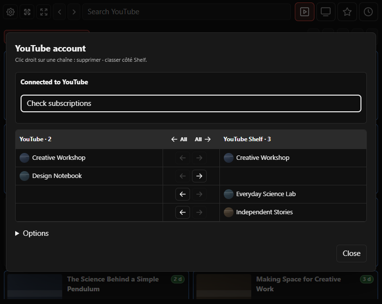

### WebDAV synchronization

Open **Settings → WebDAV synchronization**, then enter the full URL of the synchronization file, your Nextcloud username, and a dedicated application password. The default filename is:

```text
youtube-shelf-synchronized-data.json
```

Use **Test connection** before enabling synchronization. Credentials remain in the extension's local browser storage and are never included in synchronized data or exports. **Disconnect** removes the stored application password.

Synchronization includes content data—categories, channels, favorites, seen videos, and `Watch later`. Appearance, zoom, layout preferences, and regenerable YouTube feed caches remain local to each browser.

The newest configuration wins using its update timestamp, revision, and device identifier. Local changes are grouped for 10 seconds, remote changes are checked every 60 seconds while the panel is open, and conditional WebDAV writes use ETags to reduce overwrite conflicts.

## Privacy and permissions

YouTube Shelf has no analytics and no mandatory remote account. Its regular network access is limited to the resources needed to read YouTube pages, channel feeds, thumbnails, and release information. Reading account subscriptions uses the existing `youtube.com` website session only after an explicit action, and optional WebDAV access is requested only for the server origin chosen by the user.

The extension permissions are used to:

- store configuration and playback state locally;
- open and coordinate the side panel, full-page view, and YouTube tabs;
- adjust the YouTube page for focus and playback integration;
- add toolbar context-menu actions;
- access YouTube content and thumbnails;
- read account subscriptions from an explicitly opened, signed-in YouTube tab;
- check GitHub release metadata;
- connect to an explicitly configured HTTPS WebDAV server.

## Development

No compilation or bundling is required. Edit the source files, then reload the unpacked extension from the browser's extension management page.

The screenshot harness (`tools/snapshot-server.mjs` and `tools/capture-readme.cjs`, using Playwright) loads the real extension interface with fictional local data. It exists only for documentation captures and is not part of the installed extension runtime.

See [CHANGELOG.md](CHANGELOG.md) for release history.

## License

Copyright © 2026 nicklausFR

Licensed under [GPL-3.0-or-later](LICENSE).
